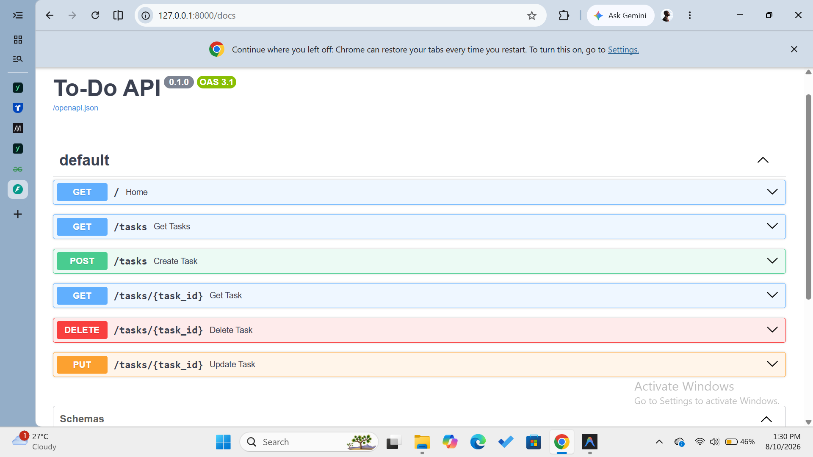
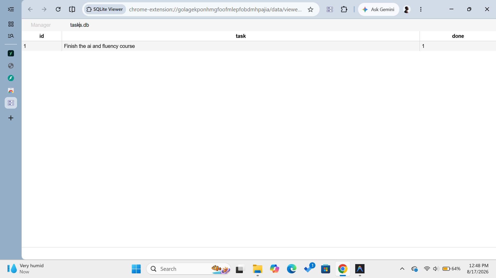

# Flyrank AI: CRUD Assignement

## Tech Stack Used

- Fast API and HTML

Pydantic was used for the data validation and FastAPI for building the API.

It is a simple to-do list application that can be used to manage tasks in a todo list.

Here are the CRUD endpoints:

- GET "/" - Returns a welcome message
- POST "/tasks" - Creates a new task
- GET "/tasks" - Returns all tasks
- GET "/tasks/{task_id}" - Returns a specific task
- DELETE "/tasks/{task_id}" - Deletes a specific task
- PUT "/tasks/{task_id}" - Updates a specific task

To run the application, use the commands
pip install fastapi uvicorn
python -m uvicorn app:app --reload

Here is the view of the swagger docs

The swagger UI can be accessed on the following URL:
http://127.0.0.1:8000/docs

The data is now stored in a sqlite database and can be retrieved from there. The data is stored in the tasks.db file and not the python dictionary.

### DB Choice

I chose sqlite3 because it is easy to setup, and lightweight for a simple application like this and can easily run on my local machine.

Here is an image of the database table in the db viewer:

I've also added a feature to filter tasks based on their status (done or not done).
You can use the `done` query parameter to filter tasks. For example:
http://127.0.0.1:8000/tasks?done=True
